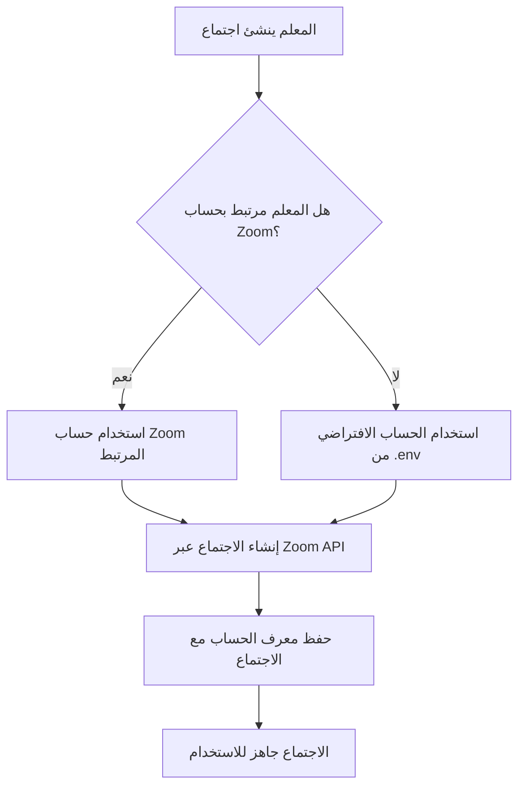

# 🔗 دليل إدارة حسابات Zoom المتعددة
## Multi Zoom Accounts Management Guide

---

## 📋 نظرة عامة / Overview

تم بناء نظام كامل لدعم استخدام أكثر من حساب Zoom في المنصة التعليمية. يسمح هذا النظام بإضافة حسابات Zoom متعددة وربط كل معلم بحساب Zoom محدد، مما يوفر مرونة أكبر في إدارة الاجتماعات والموارد.

A complete system has been built to support multiple Zoom accounts in the educational platform. This system allows adding multiple Zoom accounts and linking each teacher to a specific Zoom account, providing greater flexibility in managing meetings and resources.

---

## 🎯 الميزات الرئيسية / Key Features

### ✅ إدارة حسابات Zoom
- إضافة حسابات Zoom متعددة من لوحة التحكم
- تعديل وحذف الحسابات
- تفعيل/تعطيل الحسابات
- اختبار الاتصال بكل حساب
- عرض إحصائيات لكل حساب (عدد المعلمين، الاجتماعات)

### ✅ ربط المعلمين بالحسابات
- ربط كل معلم بحساب Zoom محدد
- إمكانية ربط عدة معلمين بنفس الحساب
- فك ارتباط المعلم من الحساب

### ✅ إنشاء اجتماعات ذكية
- يتم إنشاء الاجتماع تلقائياً باستخدام حساب Zoom المرتبط بالمعلم
- دعم الحساب الافتراضي في حال عدم ربط المعلم بحساب محدد
- حفظ معرف الحساب المستخدم مع كل اجتماع

---

## 📚 المحتويات / Contents

1. [الحصول على بيانات حساب Zoom](#getting-zoom-credentials)
2. [إضافة حساب Zoom جديد](#adding-new-account)
3. [ربط المعلم بحساب Zoom](#linking-teacher)
4. [إدارة الحسابات](#managing-accounts)
5. [استكشاف الأخطاء](#troubleshooting)
6. [التفاصيل التقنية](#technical-details)

---

## 🔑 1. الحصول على بيانات حساب Zoom {#getting-zoom-credentials}

### الخطوات التفصيلية:

#### أ. إنشاء تطبيق Zoom

1. **زيارة Zoom Marketplace**
   - اذهب إلى: https://marketplace.zoom.us/
   - سجل الدخول بحسابك في Zoom

2. **إنشاء تطبيق Server-to-Server OAuth**
   - اضغط على "Develop" من القائمة العلوية
   - اختر "Build App"
   - اختر نوع التطبيق: **"Server-to-Server OAuth"**
   - اضغط "Create"

3. **تسمية التطبيق**
   - أدخل اسم التطبيق، مثل: "Edu-Dream Platform"
   - أكمل المعلومات المطلوبة

#### ب. الحصول على البيانات الأساسية

بعد إنشاء التطبيق، ستحصل على:

```plaintext
Account ID:      m8VMK4ZyRkeAN0btuHP_mA
Client ID:       A_YMIa68Rky5zPRCGHyxOw
Client Secret:   bUKVISRcjhcxMuViOj39hqzi5lt5z44n6
```

⚠️ **مهم جداً**: احفظ هذه البيانات في مكان آمن!

#### ج. تفعيل الصلاحيات المطلوبة (Scopes)

في صفحة التطبيق، اذهب إلى قسم "Scopes" وفعّل:

- ✅ `meeting:write:admin` - إنشاء اجتماعات
- ✅ `meeting:read:admin` - قراءة معلومات الاجتماعات
- ✅ `meeting:update:admin` - تحديث الاجتماعات
- ✅ `meeting:delete:admin` - حذف الاجتماعات
- ✅ `user:read:admin` - قراءة معلومات المستخدمين

#### د. تفعيل التطبيق

- اضغط على "Activate" أو "Publish"
- أكمل أي متطلبات إضافية من Zoom

---

## ➕ 2. إضافة حساب Zoom جديد {#adding-new-account}

### من لوحة تحكم الإدارة:

#### الطريقة 1: عبر الواجهة الرسومية

1. **الدخول لإدارة حسابات Zoom**
   ```
   لوحة التحكم → Admin Dashboard → إدارة حسابات Zoom
   ```

2. **إضافة حساب جديد**
   - اضغط على زر "➕ إضافة حساب جديد"
   - املأ البيانات التالية:

   **المعلومات الأساسية:**
   - **اسم الحساب**: مثل "حساب Zoom - العلوم"
   - **البريد الإلكتروني**: البريد المرتبط بالحساب
   - **الوصف**: وصف مختصر للحساب (اختياري)

   **بيانات الاتصال (API Credentials):**
   - **Account ID**: من Zoom Marketplace
   - **Client ID**: من Zoom Marketplace
   - **Client Secret**: من Zoom Marketplace

   **الإعدادات والقيود:**
   - **الحد الأقصى للاجتماعات في اليوم**: 100 (افتراضي)
   - **الحد الأقصى للمشاركين**: 300 (افتراضي)
   
   **الميزات المتاحة:**
   - ☑️ تسجيل (Recording)
   - ☑️ نسخ نصي (Transcription)
   - ☑️ غرف منفصلة (Breakout Rooms)
   - ☑️ استطلاعات (Polling)

3. **حفظ الحساب**
   - اضغط على "💾 حفظ الحساب"
   - سيتم اختبار الاتصال تلقائياً

#### الطريقة 2: عبر قاعدة البيانات (للمطورين)

```sql
INSERT INTO zoom_accounts (
    name,
    email,
    account_id,
    client_id,
    client_secret,
    description,
    max_meetings_per_day,
    max_participants,
    features,
    is_active,
    created_by,
    updated_by,
    created_at,
    updated_at
) VALUES (
    'حساب Zoom - اللغات',
    'languages@zoom.edu-dream.com',
    'YOUR_ACCOUNT_ID',
    'YOUR_CLIENT_ID',
    'YOUR_CLIENT_SECRET',
    'حساب مخصص لمعلمي اللغات',
    100,
    300,
    '["recording", "transcription"]',
    1,
    1, -- معرف المستخدم المنشئ
    1,
    NOW(),
    NOW()
);
```

#### الطريقة 3: عبر Seeder (للتطوير)

أضف للملف `database/seeders/ZoomAccountSeeder.php`:

```php
[
    'name' => 'حساب Zoom الجديد',
    'email' => 'new@zoom.edu-dream.com',
    'account_id' => 'YOUR_ACCOUNT_ID',
    'client_id' => 'YOUR_CLIENT_ID',
    'client_secret' => 'YOUR_CLIENT_SECRET',
    'description' => 'وصف الحساب',
    'max_meetings_per_day' => 100,
    'max_participants' => 300,
    'features' => ['recording', 'polling'],
    'is_active' => true,
]
```

ثم نفذ:
```bash
php artisan db:seed --class=ZoomAccountSeeder
```

---

## 🔗 3. ربط المعلم بحساب Zoom {#linking-teacher}

### الطريقة الأولى: من صفحة المعلمين

1. اذهب إلى: `Admin Dashboard → المعلمون`
2. ابحث عن المعلم المطلوب
3. اضغط على زر "🔗 ربط" بجانب اسم المعلم
4. اختر حساب Zoom من القائمة
5. اضغط "ربط"

### الطريقة الثانية: من صفحة تعديل المعلم

1. اذهب إلى: `Admin Dashboard → المعلمون → تعديل`
2. اختر حساب Zoom من قائمة "حساب Zoom"
3. احفظ التعديلات

### ملاحظات مهمة:

✅ **يمكن ربط عدة معلمين بنفس الحساب**
- مثال: 3 معلمين علوم يستخدمون حساب واحد

✅ **يمكن فك الارتباط في أي وقت**
- اضغط على "🔓 فك الربط" من صفحة المعلمين

⚠️ **الحساب يجب أن يكون نشطاً**
- تأكد من تفعيل الحساب قبل الربط

---

## 🛠️ 4. إدارة الحسابات {#managing-accounts}

### أ. عرض تفاصيل الحساب

من صفحة إدارة حسابات Zoom:
- اضغط على أيقونة "👁️ عرض" بجانب الحساب

ستشاهد:
- 📊 **الإحصائيات**: عدد المعلمين والاجتماعات
- 👥 **قائمة المعلمين المرتبطين**
- 📹 **آخر الاجتماعات**
- ⚙️ **معلومات النظام**: من أنشأ، آخر تحديث

### ب. تعديل الحساب

1. اضغط على "✏️ تعديل"
2. عدّل المعلومات المطلوبة
3. **ملاحظة**: يمكن ترك Client Secret فارغاً للإبقاء على القديم
4. احفظ التعديلات

### ج. اختبار الاتصال

- اضغط على أيقونة "🔌 اختبار الاتصال"
- سيتم التحقق من صحة البيانات والاتصال بـ Zoom API
- ستظهر رسالة نجاح أو فشل

### د. تفعيل/تعطيل الحساب

- اضغط على أيقونة "⏸️ تعطيل" أو "▶️ تفعيل"
- الحسابات المعطلة:
  - ✅ تبقى في قاعدة البيانات
  - ❌ لا يمكن استخدامها لإنشاء اجتماعات جديدة
  - ❌ لا تظهر عند ربط معلم جديد

### هـ. حذف الحساب

⚠️ **تحذير**: لا يمكن حذف حساب يحتوي على اجتماعات نشطة!

1. اضغط على "🗑️ حذف"
2. أكد عملية الحذف
3. سيتم:
   - فك ارتباط جميع المعلمين تلقائياً
   - حذف سجل الحساب من قاعدة البيانات
   - **ملاحظة**: الاجتماعات المنتهية تبقى للسجلات

---

## 🔄 5. كيفية عمل النظام تلقائياً

### عند إنشاء اجتماع:



### مثال عملي:

1. **المعلم أحمد** مرتبط بـ "حساب Zoom - العلوم"
2. عندما ينشئ اجتماعاً، سيستخدم النظام تلقائياً:
   ```
   Account ID: حساب العلوم
   Client ID: معرف حساب العلوم
   Client Secret: مفتاح حساب العلوم
   ```

3. يتم حفظ `zoom_account_id` في جدول `zoom_meetings`
4. عند تعديل أو حذف الاجتماع، يستخدم نفس الحساب

---

## 🐛 6. استكشاف الأخطاء {#troubleshooting}

### مشكلة: فشل إنشاء الاجتماع

**الأعراض:**
```
Failed to get Zoom access token
```

**الحلول:**
1. تحقق من صحة بيانات الحساب (Account ID, Client ID, Client Secret)
2. تأكد من تفعيل الحساب في Zoom Marketplace
3. تحقق من الصلاحيات (Scopes) في التطبيق
4. استخدم أداة "اختبار الاتصال" من لوحة التحكم

### مشكلة: لا يظهر الحساب عند الربط

**الحلول:**
1. تأكد من أن الحساب **نشط** (is_active = true)
2. راجع صفحة إدارة حسابات Zoom
3. فعّل الحساب إذا كان معطلاً

### مشكلة: خطأ عند حذف الحساب

**الرسالة:**
```
لا يمكن حذف الحساب لأنه يحتوي على X اجتماع نشط
```

**الحلول:**
1. أنهِ جميع الاجتماعات النشطة أولاً
2. أو ألغِ الاجتماعات المجدولة
3. ثم احذف الحساب

### مشكلة: Token Expired

**الحلول:**
- لا داعي للقلق! النظام يجدد الـ Token تلقائياً
- يتم حفظ Token في Cache لمدة 50 دقيقة
- إذا انتهت صلاحيته، سيطلب النظام token جديد تلقائياً

---

## 💻 7. التفاصيل التقنية {#technical-details}

### أ. هيكل قاعدة البيانات

#### جدول `zoom_accounts`

```sql
CREATE TABLE zoom_accounts (
    id BIGINT PRIMARY KEY AUTO_INCREMENT,
    name VARCHAR(255) NOT NULL,
    email VARCHAR(255) UNIQUE NOT NULL,
    account_id VARCHAR(255) NOT NULL,
    client_id VARCHAR(255) NOT NULL,
    client_secret TEXT NOT NULL,
    is_active BOOLEAN DEFAULT TRUE,
    description TEXT,
    max_meetings_per_day INT DEFAULT 100,
    max_participants INT DEFAULT 300,
    features JSON,
    created_by BIGINT,
    updated_by BIGINT,
    created_at TIMESTAMP,
    updated_at TIMESTAMP,
    
    INDEX idx_is_active_email (is_active, email),
    FOREIGN KEY (created_by) REFERENCES users(id) ON DELETE CASCADE,
    FOREIGN KEY (updated_by) REFERENCES users(id) ON DELETE SET NULL
);
```

#### ربط المعلمين: `users.zoom_account_id`

```sql
ALTER TABLE users 
ADD COLUMN zoom_account_id BIGINT NULL,
ADD FOREIGN KEY (zoom_account_id) 
    REFERENCES zoom_accounts(id) 
    ON DELETE SET NULL;
```

#### ربط الاجتماعات: `zoom_meetings.zoom_account_id`

```sql
ALTER TABLE zoom_meetings 
ADD COLUMN zoom_account_id BIGINT NULL,
ADD FOREIGN KEY (zoom_account_id) 
    REFERENCES zoom_accounts(id) 
    ON DELETE SET NULL;
```

### ب. ZoomService - الخدمة الأساسية

#### إنشاء Instance مع حساب محدد:

```php
// استخدام حساب محدد
$zoomAccount = ZoomAccount::find($accountId);
$zoomService = new ZoomService($zoomAccount);

// أو استخدام الحساب الافتراضي من .env
$zoomService = new ZoomService();
```

#### Token Caching - التخزين المؤقت:

```php
// كل حساب له cache key خاص
$cacheKey = 'zoom_access_token_' . md5($accountId . $clientId);

// يتم تجديد Token تلقائياً كل 50 دقيقة
Cache::put($cacheKey, $accessToken, now()->addMinutes(50));
```

### ج. Controllers

#### ZoomAccountController
- **الموقع**: `app/Http/Controllers/Admin/ZoomAccountController.php`
- **المسؤوليات**: CRUD operations + اختبار الاتصال

#### ZoomMeetingController
- **التعديلات**: استخدام `getZoomService()` للحصول على الخدمة المناسبة
- **الذكاء**: اختيار الحساب بناءً على المعلم تلقائياً

### د. Routes

```php
// إدارة حسابات Zoom
Route::resource('admin.zoom-accounts', ZoomAccountController::class);
Route::post('admin/zoom-accounts/{zoomAccount}/toggle-active', 'toggleActive');
Route::post('admin/zoom-accounts/{zoomAccount}/test-connection', 'testConnection');

// ربط المعلمين
Route::post('admin/teachers/{teacher}/link-zoom-account', 'linkZoomAccount');
Route::post('admin/teachers/{teacher}/unlink-zoom-account', 'unlinkZoomAccount');
```

### هـ. Vue Components

1. **Index.vue** - قائمة الحسابات مع فلترة وبحث
2. **Create.vue** - إضافة حساب جديد
3. **Edit.vue** - تعديل حساب موجود
4. **Show.vue** - عرض تفاصيل الحساب والإحصائيات

---

## 📊 8. أمثلة الاستخدام

### مثال 1: منصة صغيرة (2-3 حسابات)

```
حساب Zoom #1 - العلوم
├── معلم الرياضيات
├── معلم الفيزياء
└── معلم الكيمياء

حساب Zoom #2 - اللغات
├── معلم اللغة العربية
├── معلم اللغة الإنجليزية
└── معلم الفرنسية

حساب Zoom #3 - المواد الإنسانية
├── معلم التاريخ
├── معلم الجغرافيا
└── معلم الفلسفة
```

### مثال 2: منصة كبيرة (حساب لكل معلم)

```
حساب Zoom - أحمد
└── المعلم أحمد

حساب Zoom - فاطمة
└── المعلمة فاطمة

حساب Zoom - محمد
└── المعلم محمد
```

### مثال 3: نموذج هجين

```
حساب Zoom - Premium (للمعلمين المميزين)
├── معلم كبير 1
└── معلم كبير 2

حساب Zoom - Standard (للمعلمين العاديين)
├── معلم 1
├── معلم 2
├── معلم 3
├── معلم 4
└── معلم 5
```

---

## 🔐 9. الأمان والخصوصية

### تشفير البيانات الحساسة:

- ✅ `client_secret` يتم تخزينه في قاعدة البيانات (يُفضل تشفيره لاحقاً)
- ✅ Access Token يُخزن في Cache فقط (50 دقيقة)
- ✅ لا يتم عرض Client Secret في واجهة التعديل

### الصلاحيات:

- ✅ إدارة حسابات Zoom: **Admin فقط**
- ✅ ربط المعلم بحساب: **Admin فقط**
- ✅ إنشاء اجتماعات: **Teacher + Admin**
- ✅ الانضمام للاجتماعات: **Students + Teachers**

### Logs:

```php
Log::info('Zoom account verified successfully', [
    'account_id' => $zoomAccount->id,
    'name' => $zoomAccount->name
]);

Log::error('Failed to verify Zoom account credentials', [
    'account_id' => $zoomAccount->id,
    'error' => $e->getMessage()
]);
```

---

## 📈 10. التطوير المستقبلي

### المقترحات:

- [ ] إضافة **تشفير** لـ Client Secret في قاعدة البيانات
- [ ] **Dashboard** متقدم لإحصائيات كل حساب
- [ ] **تنبيهات** عند اقتراب الوصول للحد الأقصى
- [ ] **Auto-scaling**: توزيع المعلمين تلقائياً على الحسابات
- [ ] **Webhooks**: استقبال تحديثات من Zoom
- [ ] **Reports**: تقارير استخدام مفصلة لكل حساب
- [ ] **Billing**: ربط مع نظام الفوترة
- [ ] **Multi-language**: دعم لغات إضافية في الواجهات

---

## 📞 الدعم والمساعدة

### في حالة المشاكل:

1. **راجع السجلات (Logs)**:
   ```bash
   tail -f storage/logs/laravel.log
   ```

2. **تحقق من الاتصال**:
   - استخدم أداة "اختبار الاتصال" في لوحة التحكم

3. **تواصل مع الدعم الفني**:
   - 📧 Email: support@edu-dream.com
   - 💬 Chat: [رابط الدردشة]
   - 📱 Phone: +966-XX-XXX-XXXX

---

## ✅ قائمة التحقق (Checklist)

### عند إضافة حساب Zoom جديد:

- [ ] الحصول على بيانات الحساب من Zoom Marketplace
- [ ] إضافة الحساب عبر لوحة التحكم
- [ ] اختبار الاتصال بالحساب
- [ ] ربط المعلم (أو المعلمين) بالحساب
- [ ] إنشاء اجتماع تجريبي للتأكد
- [ ] التحقق من ظهور الحساب في الإحصائيات

### عند حدوث مشكلة:

- [ ] مراجعة السجلات (Logs)
- [ ] التحقق من صحة البيانات
- [ ] اختبار الاتصال
- [ ] مراجعة الصلاحيات في Zoom
- [ ] التواصل مع الدعم الفني إذا استمرت المشكلة

---

## 📝 الخلاصة

تم بناء نظام متكامل لإدارة حسابات Zoom المتعددة يتضمن:

1. ✅ إدارة كاملة من لوحة التحكم
2. ✅ ربط ذكي بين المعلمين والحسابات
3. ✅ إنشاء اجتماعات تلقائي باستخدام الحساب المناسب
4. ✅ واجهات مستخدم احترافية وسهلة الاستخدام
5. ✅ أمان وموثوقية عالية
6. ✅ قابلية للتوسع والتطوير

**النظام جاهز للاستخدام الفوري!** 🚀

---

**تم التطوير بواسطة فريق Edu-Dream** 🎓

**آخر تحديث**: 9 نوفمبر 2025

**الإصدار**: 1.0.0

